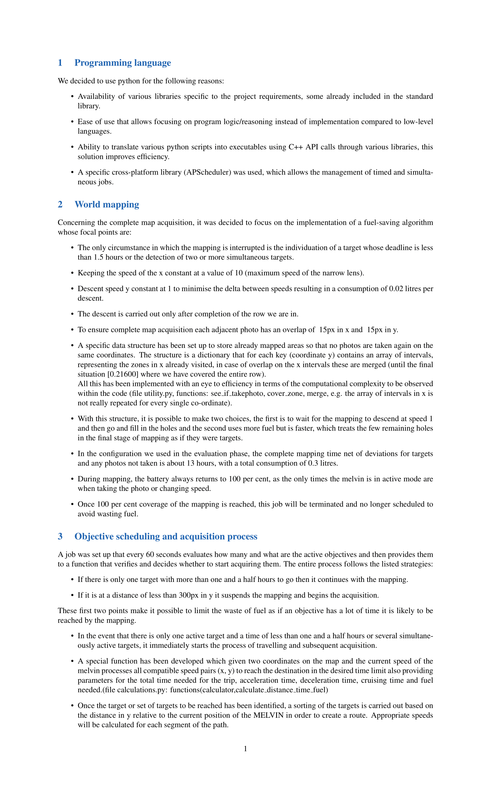

# ESA CHALLENGE COMPUTER IN A ROOM

## Objectives completed during the challenge

Obj1 | Obj2 | Obj3 | Obj4
------------ | ------------- | ------------- |-------------
| |  | 

Obj5 | Obj6 | Obj7 | Obj8 |
------------ | ------------- | ------------- | -------------
 |  |  | 

Obj9 | Obj10
------------ | ------------- |
 | 

